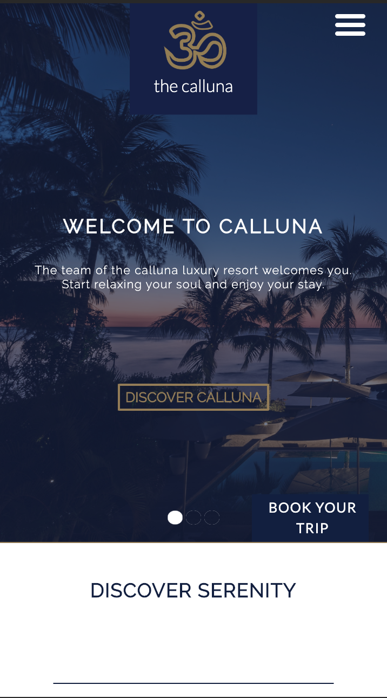

# Website Mockup

The purpose of this repo was to build a responsive website from a mockup design.

## Screenshots
### Desktop View

### Mobile View

## Original Design

 The inspiration for this project came from the [Calluna Luxury Hotel Website from Dribble.com](https://dribbble.com/shots/2336228-Calluna-Luxury-Hotel-Website/attachments/445452)

## Built With

* HTML
* CSS

## Contributing

I still would like to add more funtionality to this site, to take it to the next level. If you have any comments or suggestions please feel free to contact me. 

## Authors

* Lorenzo Lucas 

